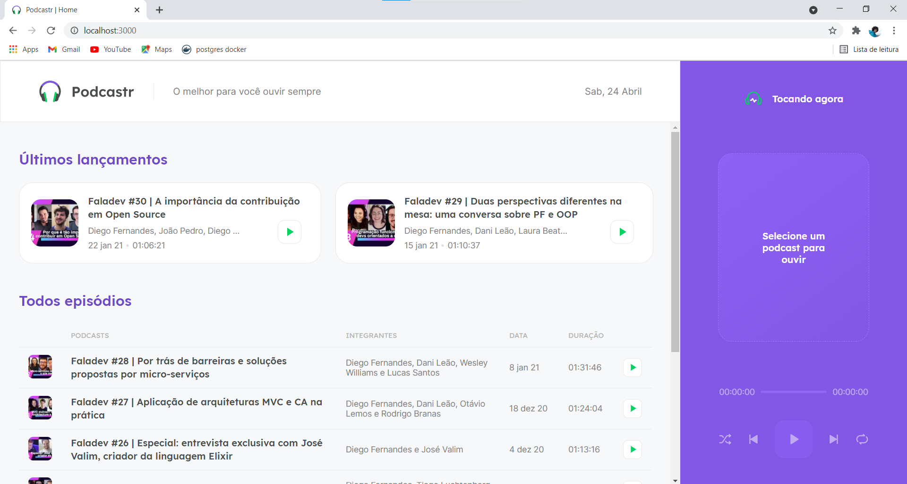
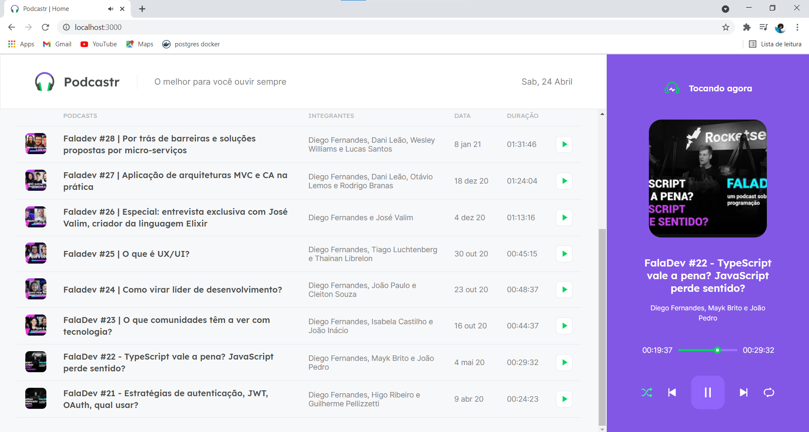

# 🛰️ Podcastr - Web application created with Next.js

Through this application it was possible to implement the most common functionalities of a player such as: play, pause, next, previous, shufle and repeat, as well as, control the playing time of a certain audio through a slider component. All of this using React's context api and the Refs concept to manipulate native HTML elements and events using the tag.

In addition it was possible to review and learn a lot related to creating an application with Next.js, such as:

- SPA's
- Server Side Rendering
- Static Site Generation
- CSS with Sass
- Back-end within the Front-end
- Routing using File System Routing
- Using the getStaticProps, getStaticPaths and getServerSideProps methods
- Generation of static and dynamic pages
- Project Build

